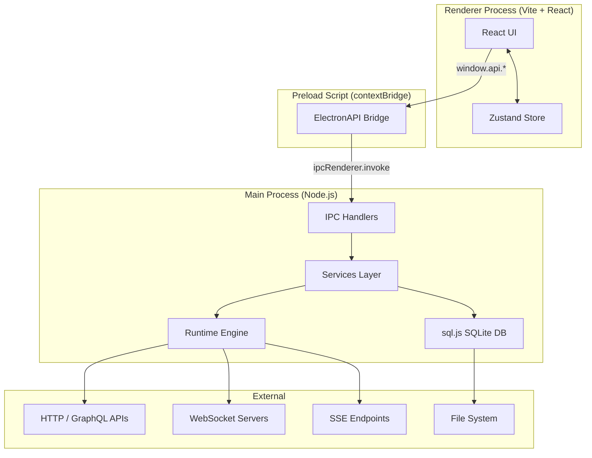
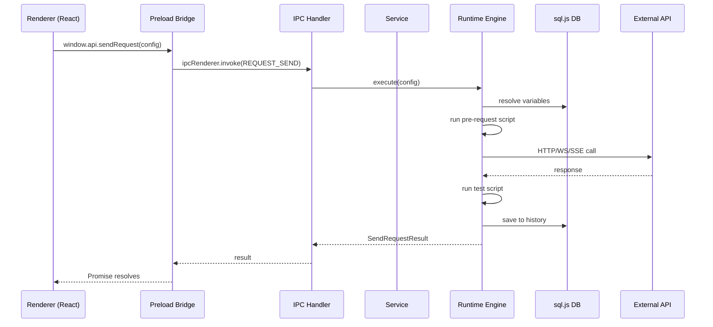

# Everest Architecture

## 1. System Overview

- **Type:** Cross-platform desktop application (Electron)
- **Architecture style:** Multi-process Electron app inside an npm monorepo
- **Key technologies:** Electron 42, React 19, TypeScript, Vite, Zustand, sql.js, Node.js
- **Communication:** Renderer → Preload (contextBridge) → Main (IPC invoke/handle)
- **Storage:** In-memory SQLite (sql.js WASM), persisted to disk as a binary file
- **Runtime:** Custom request execution engine running entirely in the Main process

---

## 2. High-Level Architecture Diagram



---

## 3. Application Layers

### Renderer Process
- **Responsibility:** All UI rendering, user interaction, local UI state
- **Location:** `apps/desktop/src/renderer/`
- **Technologies:** React 19, TypeScript, Vite, Zustand
- **Communication:** Calls `window.api.*` methods exposed by the preload bridge; receives results as Promises
- **Key subdirs:** `components/`, `store/`, `hooks/`, `utils/`, `styles/`, `i18n/`

### Preload Bridge
- **Responsibility:** Secure type-safe boundary between renderer and main; exposes `ElectronAPI` via `contextBridge`
- **Location:** `apps/desktop/src/preload/preload.ts`
- **Technologies:** Electron `contextBridge`, `ipcRenderer`
- **Pattern:** All IPC channels are named constants from `@everest/core` (`IPC_CHANNELS`)
- **Security:** `contextIsolation: true`, `nodeIntegration: false`

### Main Process
- **Responsibility:** OS integration, database, IPC routing, all business logic execution
- **Location:** `apps/desktop/src/main/`
- **Technologies:** Node.js, Electron, TypeScript (compiled with `tsc`)
- **Entry point:** `main.ts` — initializes DB → registers IPC handlers → creates BrowserWindow

### IPC Handlers
- **Responsibility:** Route IPC calls to appropriate services
- **Location:** `apps/desktop/src/main/ipc/`
- **Files:** `request.ipc.ts`, `collection.ipc.ts`, `environment.ipc.ts`, `history.ipc.ts`, `import-export.ipc.ts`, `script-runner.ipc.ts`, `codegen.ipc.ts`, `protocol.ipc.ts`, `mock.ipc.ts`, `plugin.ipc.ts`

### Services Layer
- **Responsibility:** Domain business logic (CRUD, protocol handling, import/export)
- **Location:** `apps/desktop/src/main/services/`
- **Key services:**
  - `collection-service.ts` — collection/item CRUD
  - `environment-service.ts` — environment/variable management
  - `request-engine.ts` — delegates to runtime
  - `import-export-service.ts` — Postman/OpenAPI import/export
  - `websocket-service.ts` — WebSocket connection management
  - `sse-service.ts` — Server-Sent Events management
  - `mock-service.ts` — local mock server
  - `script-sandbox.ts` — script execution sandbox
  - `codegen-service.ts` — code generation for multiple targets
  - `plugin-service.ts` — plugin loading and management
  - `auth-service.ts` — authentication helper
  - `runner-service.ts` — collection runner coordination
  - `graphql-service.ts` — GraphQL introspection/execution
  - `history-service.ts` — request history persistence

### Runtime Engine
- **Responsibility:** Request execution, variable resolution, script execution, test evaluation, collection running
- **Location:** `apps/desktop/src/main/runtime/`
- **Key files:**
  - `runtime-engine.ts` — orchestrates full request lifecycle
  - `request-executor.ts` — HTTP execution via axios
  - `variable-resolver.ts` — resolves `{{variable}}` placeholders
  - `environment-manager.ts` — environment/global variable access
  - `collection-runner.ts` — sequential collection execution
  - `folder-runner.ts` — folder-level execution within runner
  - `iteration-data-manager.ts` — data-driven iteration support
  - `report-generator.ts` — runner result reporting
  - `test-result-engine.ts` — assertion evaluation
  - `collection-variable-manager.ts` — runner-scoped variable state
  - `script-engine/` — Postman-compatible `pm.*` API sandbox

### Storage Layer
- **Responsibility:** Persistent data storage
- **Location:** `apps/desktop/src/main/storage/`
- **Technology:** sql.js (SQLite compiled to WebAssembly)
- **Persistence file:** `<userData>/data/everest.db`
- **Strategy:** In-memory DB at runtime; auto-saved to disk every 30 seconds (dirty-flag based) + forced save on quit
- **Schema management:** SQL migration files (`001-init.sql` … `004-runtime-state.sql`)

### Shared Core Package
- **Responsibility:** Shared TypeScript types, interfaces, and constants used by both main and renderer
- **Location:** `packages/core/src/`
- **Key files:** `types.ts`, `constants.ts` (IPC channel names), `index.ts`
- **Published as:** `@everest/core` (internal npm workspace package)

---

## 4. Repository Architecture

```
Everest/                          # Monorepo root (npm workspaces)
├── apps/
│   └── desktop/                  # Electron application
│       ├── src/
│       │   ├── main/             # Electron main process (Node.js)
│       │   │   ├── main.ts       # Entry point
│       │   │   ├── ipc/          # IPC channel handlers (11 files)
│       │   │   ├── services/     # Business logic services (14 files)
│       │   │   ├── runtime/      # Request/runner execution engine
│       │   │   │   └── script-engine/  # pm.* API sandbox
│       │   │   ├── storage/      # sql.js DB + SQL migrations
│       │   │   ├── types/        # Main-process-specific types
│       │   │   ├── utils/        # Main-process utilities
│       │   │   └── menu.ts       # Native app menu
│       │   ├── preload/
│       │   │   └── preload.ts    # contextBridge API surface
│       │   └── renderer/         # React UI (Vite)
│       │       ├── App.tsx
│       │       ├── components/
│       │       ├── store/        # Zustand state
│       │       ├── hooks/
│       │       ├── i18n/         # Internationalization
│       │       ├── utils/
│       │       └── styles/
│       ├── resources/            # App icons (icns, ico, png)
│       ├── vite.config.mts       # Renderer build config
│       ├── tsconfig.main.json    # TSConfig for main process
│       └── tsconfig.renderer.json # TSConfig for renderer process
├── packages/
│   └── core/                     # Shared npm package
│       └── src/
│           ├── types.ts          # All shared TypeScript types
│           ├── constants.ts      # IPC channel name constants
│           └── index.ts          # Package exports
└── scripts/                      # Release and bundle analysis scripts
```

---

## 5. Core Runtime Architecture

### Request Execution Flow

```
User sends request (Renderer)
  → window.api.sendRequest(config, environmentId)
  → ipcRenderer.invoke(REQUEST_SEND, ...)
  → request.ipc.ts handler
  → runtime-engine.ts
      → variable-resolver.ts (resolve {{vars}})
      → script-engine/sandbox.ts (pre-request script)
      → request-executor.ts (axios HTTP call)
      → script-engine/sandbox.ts (test script)
      → test-result-engine.ts (assert test results)
  → history-service.ts (persist to DB)
  → response returned to renderer
```

### Collection Runner Flow

```
User starts runner (Renderer)
  → window.api.runCollection(config)
  → runner.ipc.ts
  → runner-service.ts
  → collection-runner.ts
      → folder-runner.ts (per folder)
          → runtime-engine.ts (per request, with delays)
          → iteration-data-manager.ts (data-driven runs)
      → report-generator.ts
  → result streamed back via IPC events
```

### Variable Resolution Priority (runtime)
1. Collection-level variables (runner scope)
2. Environment variables
3. Global variables

---

## 6. Data Flow



---

## 7. Communication Between Components

| Channel | Mechanism | Direction |
|---|---|---|
| Renderer → Main | `ipcRenderer.invoke` / `ipcMain.handle` | Bidirectional (request/response) |
| Main → Renderer (push) | `mainWindow.webContents.send` + `ipcRenderer.on` | Push events (runner progress) |
| Preload bridge | `contextBridge.exposeInMainWorld('api', ...)` | Renderer access to IPC |
| UI state | Zustand stores | In-renderer only |
| Shared types/constants | `@everest/core` npm workspace package | Compile-time only |

- All IPC channel names are constants defined in `packages/core/src/constants.ts`.
- `contextIsolation: true` enforces that the renderer has no direct Node.js access.

---

## 8. Storage Architecture

| Aspect | Detail |
|---|---|
| Engine | sql.js (SQLite compiled to WASM) |
| Runtime state | In-memory `SqlJsDatabase` instance |
| Persistence file | `<Electron userData>/data/everest.db` |
| Auto-save | Every 30 seconds, only when dirty flag is set |
| Forced save | On `before-quit` event |
| Schema management | SQL migration files applied in order at startup |
| Migration tracking | `_migrations` table inside the DB |
| Migration files | `001-init`, `002-collections-environments`, `003-collection-scripts`, `004-runtime-state` |

---

## 9. External Dependencies

| Dependency | Purpose | Location |
|---|---|---|
| `electron` 42 | Desktop framework, process management | Main + packaging |
| `react` 19 + `react-dom` | UI rendering | Renderer |
| `vite` 8 + `@vitejs/plugin-react` | Renderer build and dev server | Renderer build |
| `typescript` 6 | Static typing across all layers | All |
| `zustand` 5 | Client-side state management | Renderer |
| `axios` | HTTP request execution | Main / Runtime |
| `sql.js` | In-process SQLite via WASM | Main / Storage |
| `ws` | WebSocket connections | Main / Services |
| `i18next` + `react-i18next` | Internationalization | Renderer |
| `uuid` | ID generation | Main / Services |
| `electron-builder` | App packaging (dmg, exe, AppImage, deb) | Build |
| `@everest/core` | Shared types and IPC constants | All layers |

---

## 10. Current Architectural Decisions

> See `.ai/06_DECISIONS.md` for full decision log.

- **sql.js over native SQLite:** Avoids native Node.js addons; WASM runs in-process without compilation issues across platforms.
- **contextIsolation + no nodeIntegration:** Follows Electron security best practices; renderer has zero direct Node.js access.
- **Monorepo with npm workspaces:** Enables `packages/core` to be shared across future apps without a separate publish step.
- **All business logic in Main process:** Keeps renderer thin; avoids exposing sensitive operations (file system, network) to the renderer context.
- **Dirty-flag auto-save:** Reduces unnecessary I/O while ensuring data durability.

---

## 11. Known Architectural Limitations

- **In-memory DB size:** sql.js loads the entire database into memory; may become a constraint with very large collections or history.
- **Single BrowserWindow:** No multi-window or multi-tab support at this time.
- **No test suite visible:** No test runner configuration was found in `package.json` scripts or project files.
- **Synchronous DB writes:** `saveDatabase()` calls `fs.writeFileSync`, which blocks the main process during write.
- **Plugin system:** `plugin-service.ts` and `plugin.ipc.ts` exist but plugin system is listed as a roadmap item — implementation maturity is unknown.
- **Mock server:** `mock-service.ts` and `mock.ipc.ts` exist but mock server is listed as a roadmap item — implementation maturity is unknown.
