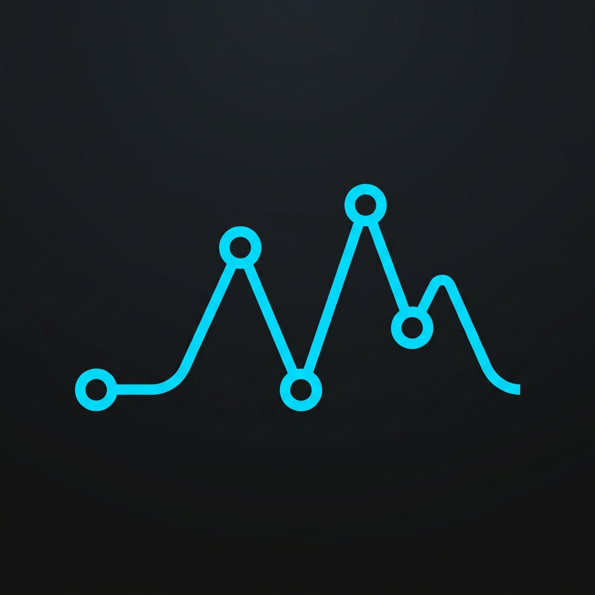

<div align="center">
  
  
  # API Testing Platform 🚀
  
  **A powerful, local-first, and secure desktop platform for API testing and development.**

  [](LICENSE)
  [](CONTRIBUTING.md)
</div>

---

## 📖 Introduction
This project is a comprehensive and robust desktop platform for API testing, built with **Electron.js**. Inspired by tools like Postman, it focuses heavily on a local-first, offline, and secure experience tailored for technical teams.

The primary goal of this software is to provide developers with a modern and professional User Experience (UX) to effortlessly manage and test HTTP requests, WebSocket connections, GraphQL, and Server-Sent Events (SSE).

## 🎯 Why This Project?
- **Internal & Secure by Design:** Keep your data, tokens, and sensitive API information offline and within your organization's network.
- **Offline First:** Fully functional without an internet connection or dependency on external cloud services.
- **Total Environment Control:** No limitations imposed by third-party policies or unexpected service changes.
- **High Extensibility:** Designed to be easily customizable to fit your team's specific needs.
- **Cost-Effective:** A powerful, open-source alternative to commercial tools with similar capabilities.

## ✨ Key Features

### 🌐 Request Management
- Full support for HTTP methods (GET, POST, PUT, DELETE, etc.).
- Intuitive management of Headers, Query Parameters, and Body (JSON, Form-Data, URLEncoded, Binary).
- Modern protocol support including **GraphQL, WebSocket, and Server-Sent Events (SSE)**.

### 📁 Collections
- Organize requests into deeply nested folders and collections.
- Import/Export capabilities (Postman and OpenAPI formats supported).

### 🌍 Environments & Variables
- Support for Local, Global, and Environment-level variables.
- Dynamic variable substitution (e.g., `{{base-url}}`).
- Real-time **Hover Previews** for variables in the UI.

### 🏃‍♂️ Collection Runner
- Execute sequential requests within a collection with customizable delays and iterations.
- Real-time detailed reporting on test successes and failures.

### 📜 Script Engine
- **Pre-request Scripts** to dynamically set up data before a request is sent.
- **Test Scripts** for comprehensive Response Validation.
- Postman-compatible syntax (e.g., `pm.environment.set` and `pm.test`).

### 🧪 Automated Testing
- Write assertions on Status Codes, Response Times, and Body content.
- Seamless integration with the Collection Runner for Regression Testing.

### 🎨 Modern UX/UI
- Built-in Dark and Light Modes.
- IDE-like resizable panels for a customizable layout.
- High-performance, zero-lag experience even during heavy usage.

## 🏗️ Architecture
This project is structured as a **Monorepo** (using npm workspaces) to cleanly separate core logic from the UI:

```text
project-root/
  apps/
    desktop/      # Main Electron App (Main & Renderer processes)
  packages/
    core/         # Shared npm package (Types, Interfaces, Base Logic)
```

- **`packages/core`**: Contains data models, TypeScript types, and shared interfaces. Designed to be publishable as an independent npm module.
- **`apps/desktop`**: Contains the `main` process (OS integration, file system, local DB) and the `renderer` process (UI built with React and Vite).

## 🛠️ Tech Stack
- **[Electron.js](https://electronjs.org/)** - Cross-platform desktop framework
- **[React.js](https://reactjs.org/)** - User Interface library
- **[TypeScript](https://www.typescriptlang.org/)** - Strongly typed JavaScript
- **[Vite](https://vitejs.dev/)** - Next-generation frontend tooling
- **[Zustand](https://github.com/pmndrs/zustand)** - Lightweight state management
- **Node.js** - Backend logic and file system management

## 🚀 Getting Started

### Prerequisites
Make sure you have Node.js (v18+ recommended) and npm installed on your machine.

### Installation
1. Clone the repository:
   ```bash
   git clone https://github.com/YourOrg/YourRepo.git
   cd YourRepo
   ```
2. Install all monorepo dependencies:
   ```bash
   npm install
   ```

### Running Locally (Development)
To start the app in development mode:
```bash
npm run dev
```
This command builds the `core` package, starts the Vite dev server, and launches the Electron application simultaneously.

## 📦 Building for Production

To build the complete project:
```bash
npm run build
```

To generate installers for macOS and Windows:
```bash
npm run package:mac
npm run package:win
# Or generate both:
npx electron-builder --mac --win
```
The output files will be located in `apps/desktop/dist/`.

## 🤝 Contributing
We welcome contributions from the community! To get started:
1. Fork the repository.
2. Create your feature branch (`git checkout -b feature/AmazingFeature`).
3. Commit your changes (`git commit -m 'Add some AmazingFeature'`).
4. Push to the branch (`git push origin feature/AmazingFeature`).
5. Open a Pull Request.

Please make sure to update tests as appropriate.

## 🛣️ Roadmap
- [ ] **Mock Server:** Local API simulation.
- [ ] **Cloud Sync:** Optional feature to sync collections across devices.
- [ ] **Plugin System:** Modular architecture for third-party developer plugins.
- [ ] **CI/CD Integration:** CLI tool for running collections in CI pipelines.
- [ ] **Team Collaboration:** Workspace sharing within local networks.

## 📄 License
This project is licensed under the MIT License - see the LICENSE file for details.
